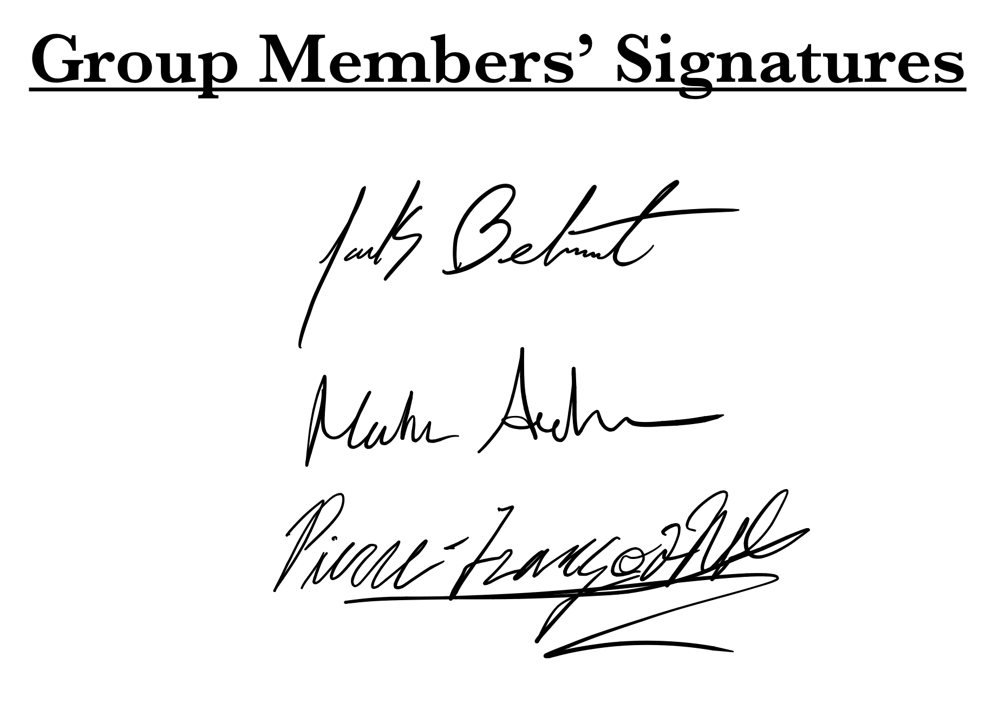

# Group4 - OSINT Lab Generation
*Authors: Maha Ashour, Jack Belmont, Pierre-Francois Wolfe*

---
## __Testing The Lab__
Please refer to the detailed student lab guide at [studentGuides/labGuideStudent.md](https://agile.bu.edu/bitbucket/projects/EC521FIN19/repos/group4/browse/studentGuides/labGuideStudent.md) if you would like to test our project. Feel free to contact [jbelmont, mash, pwolfe at bu dot edu] if you have any questions. You can also find us on the EC521 Slack.

This guide will go over where you can find the VM server image (which will host the websites that you will need to access - **the CTFd page and the attack page**). It will also go over any steps you need to follow to run the server in VMware, and then access the server via your Kali VM.

---
## __A. Detailed Explanation__
<!-- *A detailed explanation of the relevant elements of your particular technology. [90 points]* -->

### __i. Background__
<!-- *Should be clear, well-organized, and terse. [40 points]* -->

#### a. High Level Description
<!-- *A high-level description of your project, including your group number, members of your group.* -->

Our overall goal in this project is to create a lab that allows students to explore the boundary between Open Source INTelligence (OSINT) / information gathering and a cyber attack. It is easy to understand the concept of OSINT, but it can often be difficult to see how OSINT can actually be used in a cyber attack situation. Open information is dangerous and can easily be used in an attack by those who have the right experience. By having students perform advanced OSINT information gathering, and utilizing the info gained via this process in an actual cyber attack, students will begin to fully grasp the importance of information security.

This project focuses on exploring tools and techniques for working with OSINT. We guide students through some exercises and challenges that would get them comfortable with tools that were not previously explored in class and demonstrate how they can be most powerful. While many approaches exist for obtaining data and turning it into actionable intelligence, improving efficiency is important when techniques are being used more than once.

To that end, the lab introduces Maltego. This is a data mining tool that displays information as nodes in a directed graph. The core functionality allows for link analysis and provides a number of ways to visualize the data to make it easier for a user to find important relationships in complex datasets.

Maltego is also powerful due to its integration with first and third party tools that provide "transforms". These are functions that can be applied to existing entities in a graph and attempt to use information about that entity to search for additional possible links. For example, a "person" entity has several available transforms by default, including searches for possible email addresses, phone numbers, and social media accounts. Users can write custom transforms that can perform even more interesting and powerful functions.

One of the challenges of working with data from open sources is the sheer volume of such data and the resulting difficulty in identifying or finding specific information or relationships of interest. As a result we introduce a few other OSINT tools such as metagoofil, theharvester, and h8mail, which can sift through large volumes of data and return results in a condensed manner.

While OSINT is useful in and of itself, it is also extremely helpful when used to attack a target. To demonstrate the utility of OSINT in this space, we set up a lab server that can used as part of a Gather-Exploit-Attack framework, where the students have to use information gathered from open sources to identify vulnerabilities and map an attack on a target.

#### b. References
<!-- *High-quality references that you used in developing your project, in order from most influential to least influential.* -->

__Reference 1__

Maltego Support Documentation - https://docs.maltego.com/support/home

Maltego's support site has useful documentation about the features of various versions of their software. The showcases page on the site has several examples that are good departure points for our research into using Maltego and provide some ideas for types of scenarios we might want to create for an interactive lab. There are additionally some resources for extending functionality through the use of existing transforms or for the creation of custom transforms. There is also information on how to import data from offline sources.

Citation:

    “Support.” MALTEGO, docs.maltego.com/support/home.

__Reference 2__

Defining Second Generation Open Source Intelligence (OSINT) for the Defense Enterprise - https://www.rand.org/content/dam/rand/pubs/research_reports/RR1900/RR1964/RAND_RR1964.pdf

A defense industry view of OSINT. Helpful in contextualizing some of the approaches/techniques and offering a more government driven perspective that complements some of the other views.

Citation:

    Williams, Heather J, and Ilana Blum. “Defining Second Generation Open Source Intelligence (OSINT) For The Defense Enterprise.” Rand.org, www.rand.org/content/dam/rand/pubs/research_reports/RR1900/RR1964/RAND_RR1964.pdf.

__Reference 3__

Open Source Intelligence Investigation - https://link.springer.com/book/10.1007/978-3-319-47671-1

This book discusses OSINT concepts and applicability. The importance/relevance of OSINT to different organizations ins considered which can help to ground different use cases. The book covers strategies to employ while working with open source data that can help to move searches forward and to verify the information collected. Some real examples of OSINT use can help provide inspiration when crafting some scenarios for our lab generation. There is some information concerning specific tools that might be of use. *Chapter 6 was most relevant, specifically sections: 6.1 and 6.4.6*

Citation:

    Akhgar, Babak, et al. "Open Source Intelligence Investigation From Strategy to Implementation." Springer International Publishing, 2018.

__Reference 4__

News Article from The Guardian - https://www.theguardian.com/technology/2014/nov/12/tracking-isis-stalking-cia-big-brother-online-nsa

This article identifies a real world application where OSINT tools -- Maltego, metagoofil, Shodan, and others -- were used to gather information on ISIS targets. In particular, these tools helped the CIA to sift through large amounts of social media data to establish potential real identities behind accounts engaged in social media campaigns and coordinate further monitoring in case of data leaks that could provide actionable intelligence. This is one example among many illustrating the importance of OSINT.

Citation:

    Fox-Brewster, Tom. “Tracking Isis, Stalking the CIA: How Anyone Can Be Big Brother Online.” The Guardian, Guardian News and Media, 12 Nov. 2014, https://www.theguardian.com/technology/2014/nov/12/tracking-isis-stalking-cia-big-brother-online-nsa.

__Reference 5__

Defcon Presentation - https://www.defcon.org/images/defcon-20/dc-20-presentations/Douba/DEFCON-20-Douba-Sploitego.pdf

This presentation showcases the power of Maltego transforms, specifically using Sploitego which builds on the Canari Framework. We didn't use Sploitego or the Canari framework in our lab generation instead opting to introduce the ideas with the simpler framework that Paterva offers. Exploring these frameworks would be more interesting for more advanced function extensions. The security firm that sponsored the talk does not seem to be in business anymore, however, this presentation was given at a reputable conference. Additionally, the framework itself is still in use and is the largest hit when searching for maltego on github. The presentation is still helpful in considering different ways to setup transforms and make effective use of them.

Citation:

	Douba, Nadeem. "Sploitego: Maltego’s (Local) Partner in Crime." Defcon 20, Cygnos Information Security, 26-29 Jul. 2012, Las Vegas, https://www.defcon.org/images/defcon-20/dc-20-presentations/Douba/DEFCON-20-Douba-Sploitego.pdf.

#### c. Technical Content
<!-- *A detailed technical description of your project, including what you specifically implemented and describing deviations from your project report (i.e. items added or not implemented) with a brief explanation for the deviation.* -->

Status Summary of Challenges List from the Mid-Project Report:\
(*Further Commentary Below List*)

* Tool Setup
	* [x] Setup guide for each software (Probability of completion 100%)
		* [x] Installing software not included in Kali
		* [x] Any development tools needed to extend Maltego
	* [x] Any API keys needed and accounts to generate (Probability of completion 100%)
		* [x] Maltego account
		* [ ] Shodan account/API key
	* [x] Any OS configuration needed (Probability of completion 100%)
* Datasets
	* [x] Crafted (for the lab) (Probability of completion 100%)
	* [x] Collected (live data) (Probability of completion 90%)
	* [x] Establishing links between real/provided datasets
		* [x] Some links will exist, some will be contrived for the scenario (Probability of completion 90%)
		* [x] We plan to extend real data with our provided sets
			* [x] Tentatively matching with "h8mail" (Probability of completion 75%)
* More Advanced OSINT
	* [x] Maltego custom transform creation
	* [x] Blending tools together...
* Scenario Environment
	* [x] General Items needed
		* [x] Web server (for attacks)
			* [x] Simple static login page with no database (Probability of completion 100%)
			* [x] Login feature backed by database (Probability of completion 75%)
			* [ ] More sophisticated server with features allowing for further data gathering or attacks (Probability of completion 50%)
		* [x] Varied types of datasets/databases to mine
			* [x] Simple data, uniform format (Probability of completion 100%)
			* [x] Complex/noisy data, multiple formats (Probability of completion 75%)
				* [x] ex: json, csv, unstructured, metadata
	* [x] Specific Scenarios
		* [x] Simple search with OSINT tools on specific targets (Probability of completion 100%)
			* [x] Answers that can be clearly defined
		* [x] Access a server using a password/account retrieved using OSINT (Probability of completion 100%)
			* [x] From some seed information find a vulnerable individual and exploit
			* e.g.
				* [ ] List of users of some company associated with phone number dataset
				* [ ] Connect that with registration information for site domain
				* [x] Find password from leak that matches email address also from site domain
		* [x] More sophisticated/compound scenarios (Probability of completion 50%)
			* [x] Blending OSINT with active information gathered from a prior attack
			* [ ] Multiple machines or targets that need to be created or maintained
			* [ ] Multiple Gather-Exploit-Attack cycles

Commentary on Challenges List:

Considering the Tool Setup section, we explored using the Shodan account/API connection but did not integrate it into the current lab. Other transform options and the particular scenario we selected highlight the utility of Maltego. It is something we could consider adding but would likely make the most sense for an outside of lab portion for students to complete should they choose.

For the More Advanced OSINT section, we do guide students through the creation of a basic transform in Maltego and we also provide them with a more advanced custom transform that incorporates the use of other OSINT tools (theharvester). 

In the context of the webserver for the lab, we already implemented a number of features that we wanted. We included a more advanced feature like file download as way of providing data files for the students to further explore using Maltego.

We created a number of scripts that helped to generate fake data for use in our lab which we blended with some real information. We have kept this as comma separated data pairs for this lab rather than introducing additional complexity with various file formats. The students will already have to consider the options available when importing data into Maltego and other data formats would logically be a follow-on step. The data provided is complex and hides a number of relationships between different people. This should provide enough interesting material for the students but if things are too simple it might be best to incorporate accessing different file types as part of an after-lab advanced Maltego transform problem.

We also provided a custom transform that looks through the output of several runs of theharvester to find email addresses that match a given domain. Each data source used in a search returns output in a different format, so this was a way to demonstrate how to deal with sifting through mixed/unstructured data with the help of tools.

Some of the specific ideas we had for the scenario crafted changed over the course of development. We did not use user, phone number pairs but instead focused on email communications and finding passwords for users. We did not go down the path of working with network analysis or considering the registration information of a real website (potentially the real Tesla site) but do not feel that this detracts from the introduction of the tools in the lab. As with the decision to not focus on using Shodan, a number of the network analysis approaches could have been interesting but were a bit beyond the scope of our goals and did not fit into the scenario as crafted.

Following on the decisions of where to limit the use of some transforms, we did not have an overly complex cyclic scenario that would require many iterations of data gathering, processing, and analysis. We discovered that such a series of problems would be particularly challenging to introduce to students and was difficult to implement in our scenario website in the time available. 

#### d. Limitations
<!-- *Any limitations that you imposed during the implementation of your project, with a brief justification (e.g. if you did not implement all the elements of the conference talk, or if you used a particular operating system).* -->

* At the moment we are limited by the available features in the Community Edition of Maltego
* We had limited integration with 3rd party tools because some would require API access which might not be possible within the scope of the lab
* We limited our introduction of custom Maltego transforms to a single language (Python) to avoid additional complexity or redundancy
* We limited the use of h8mail to a synthetically created breach compilation to avoid downloading and distributing the actual breach compilation circulating on the dark web due to ethical/legal concerns
* We created a simulation where real information gathered using OSINT tools is used to attack a web server that we host, to avoid targeting real companies or web servers
* Since we do not have a registered domain, we provide a VM (with set up instructions) to locally host the attack web server and CTF server
* For several lab challenges we limited ourselves to scenarios that we felt we could confidently reproduce in the future
* For several CTF questions we constrained the types of questions and answers to those that could be consistently answered by everyone given any heterogeneity in the results returned from OSINT tools

#### e. Results
<!-- *The main results of your project. What did you accomplish?* -->

Our main goal was to build an educational and fun lab that could introduce OSINT concepts in an engaging manner, and challenge students to apply them to a variety of situations. We measured our success by the degree to which we were able to accomplish this goal as well as what we learned in the process of constructing this lab.

Outcomes for the Students/Lab Participants:
* Created a lab to teach OSINT concepts
* Introduced popular OSINT tools and techniques (ex: metagoofil, theharvester, h8mail, Maltego)
* Crafted situations to demonstrate added value of tools, such as when dealing with large volumes of data
* Designed a thorough introduction to Community Edition of Maltego
	* Created lab exercises specifically to showcase and teach Maltego features
	* Created a companion lab guide to walk students through the initial setup and main features
	* Provided examples for how Maltego can be used to explore data
	* Crafted synthetic data to be used with Maltego (ex: graph with ~10,000 edges)
	* Introduced the power of transforms and how custom transforms can be created
    * Provided two examples of custom transforms, including one that incorporates other tools
* Demonstrated how OSINT can be used to attack a vulnerable target
	* Built a vulnerable web server to act as the target for attacks and as a source of data for further OSINT
	* Combined synthetic data and non-synthetic data to simulate real-life attack scenarios
* Lab server can be extended to set up even more OSINT challenges, or can be used to teach other lab concepts (web attacks, etc.)
* Provided a way to assess student learning and progess in the lab
	* Set up CTFd server to provide challenge questions
	* Lab can be administered with a goal of earning at least 50 points in a 30 minute lab session
    * Distributed points evenly between sections and themes to prevent any bottle necks

What we Learned as a Group:
* Many of the features and limitations of the Community Edition of Maltego
	* Using third-party APIs with Maltego
	* Manipulating and transforming data as a directed graph, using different view tools and filters
	* Explored value of these features in extracting intelligence from raw data
* Challenges in finding, gathering, processing and analyzing information from open sources
	* Massive amounts of data can be hard to process without tools
	* OSINT labs are hard to create because results of OSINT tools are not consistent or easy to replicate
	* OSINT can involve using publicly available breach information and there are legal/ethical considerations in providing those materials to students or encouraging their use
* Learned new skills and languages (none of the team members had any significant experience using the languages below)
	* Setting up a web server
		* Learned how to set up the server securely but also introduce vulnerabilities as needed
		* Learned PHP, MySQL, HTML
	* Learned more advanced Python scripting
		* Used to create synthetic data
		* Used to create webscraper
        * Used to create custom transforms

---
### __ii. Materials__
<!--
* *All material needed to compile and run your project from scratch, together with clear and terse instructions for doing so.*
	* *Unless there is a good reason to do otherwise, all your code should appear on your group's bitbucket repository.*
	* *Make sure to provide instructions for how to install all non-standard libraries or third-party software needed, and/or how to acquire any necessary hardware.*
	* *Your code must be able to compile and run on the lab's Kali VM. If you need more memory or a different OS/CPU/hardware, please stipulate it with an explanation. If it is not something that can be reasonably acquired in a short time-frame, please talk to me about it beforehand.*
	* *I highly recommend that you try out your instructions on each other or some neutral third part to test clarity.*
* *Lab generation: Clear instructions for how to set up and run the lab, including, as necessary, third party software installation, network topology, etc.*
-->

All of the documentation is organized into a series of markdown files included in the repository:

* README.md: This is the current document and provides an entry point into the project
* Minutes.md: This file tracks meetings between contributors over time
* serverSetup.md: This file describes how to setup the web server for the scenario website used in part of the lab
* websiteNotes.md: Includes some information about the webserver. Can potentially be merged with serverSetup.md
* ctfdSetup.md: This file describes how to configure the CTFd server. Alternately, the questions can be imported into an existing server. The archive is available under the ctfdConfig directory
* generateData.md: This file describes to the instructor running the lab how to use some provided scripts to generate false data for the CTF. These scripts could be used again to create new scenarios or introduce variation between each version of the lab.
* OSINTtools.md: This file contains some information about data collection tools that were explored
* maltegoTransformGuide.md: This file contains instructions for simple transform creation in Maltego. Should be integrated into labGuideStudent.md when additional transform questions are incorporated into the lab.
* labGuideStudent.md: This file should be the handout provided to students. It gives background on tools and context for different portions of the lab. It is also helpful for the instructor to read the background provided to the students.
* labGuideInstructor.md: This file contains information about the questions/solutions that the Instructor can reference when providing guidance to the students.

---
## __B. Signed Statement__
<!-- *A signed statement from all team members detailing what each has contributed to the project. [10 points]*
*You should provide a detailed statement of each student's contribution in a document that is signed by all members. You may also choose to provide your own estimate of the percentage of work committed by each group member, to which I may refer when making my own judgment about the relative involvement of group members.* -->

* Contributions Summary
	* Jack Belmont
		* Website server setup and documentation
		* Website development (PHP and HTML)
		* Lab scenario development (false breached data generation)
		* Basic h8mail usage
	* Maha Ashour
		* Data collection tool research and testing
			* Web scraper development and testing
			* Exploring the use of metagoofil, recon-ng, theharvester, and h8mail for use in some problems
            * Set up challenges using metagooful, theharvester and h8mail
		* Custom data generation for lab (pattern creation and identification)
  		* Maltego custom transform development
		* CTFd question creation
	* Pierre-Francois Wolfe
		* Maltego testing and guides
			* Documentation in Student and Instructor guides
		* Initial CTFd server setup and documentation
		* Creation of python scripts used for fake data generation
        * Maltego custom transform development
  		* CTFd question creation      
	* Mutual
		* Each group member tested the VM creation guide to create their own copy of Ubuntu Server
		* Additionally each group member ran the website and the CTFd site from that Ubuntu Server
		* Everyone tested that they were able to connect to their own Ubuntu server from their personal Kali VM
* Refer to Minutes.md for more exact contribution tracking over time

SIGNED STATEMENT:
*If signatures are not being displayed, check /mdImages/group4_signatures.jpg file or click on the actual README.md in the root directory above*

