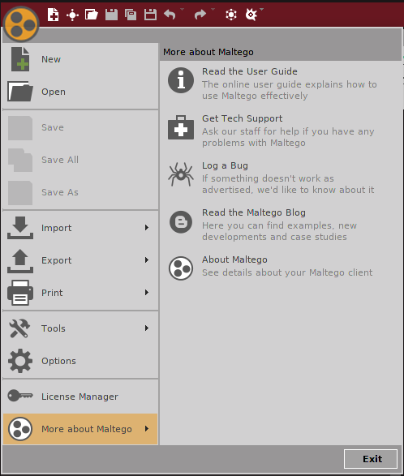
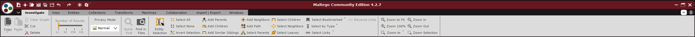
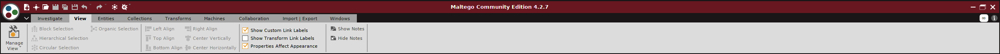
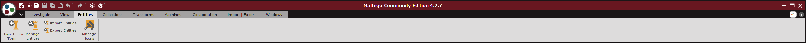
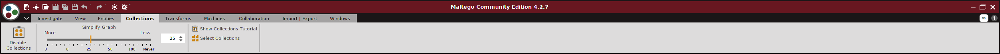
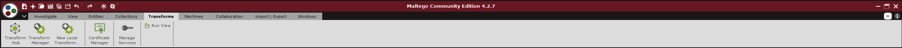
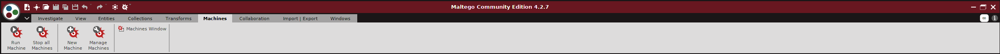
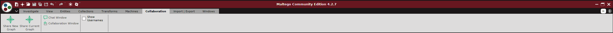
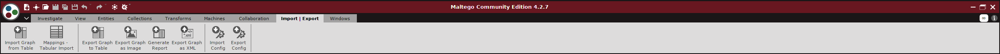

## OSINT Lab Guide for Students
There is a lot of useful information in here if you take the time to read it!
#### How to get the lab up and running if the server is not being hosted
  * You can find a copy of our server vm under /ad/eng/courses/ec/ec521/Students/Student/group4_mash/
  * Please **copy** this vm (the entire group4_mash folder) to your own personal class directory next to your Kali VM at /ad/eng/courses/ec/ec521/Students/**yourUsername**/VMs/group4_mash
  * Open up a terminal from the lab computers

  ```bash
  # This will launch VMware Workstation.
  $ vmware
  ```
  * When VMware Workstation opens make sure you can view multiple VM tabs by checking **View->Customize->Tabs**
  * You will now want to launch both your Kali VM and the Ubuntu Server VM that we provided
    * Do this by going **File->Open** and navigating to  **+ Other Locations** and then navigating to your VM at /ad/eng/courses/ec/ec521/Students/**yourUsername**/VMs/group4_mash/ and selecting the **Ubuntu 64-bit.vmx** file
    * Click on **Start up this guest operating system**
      * When prompted by a dialog box make sure to click on **"I Copied It"** so you get assigned a new MAC Address
    * Make sure that you repeated the above steps to launch both VM's!
    * You should not proceed until you have both VM's upen in VMware Workstation
  * **THE SERVERS WILL AUTOMATICALLY BOOT UP ON START OF THE UBUNTU SERVER VM**
  * Go to a terminal on your **host machine** (*Not in any vm*)
    * You will be looking for the IP address of the Ubuntu Server's VM. You can get this with the following command:

  ```bash
  $ vmrun getGuestIPAddress /ad/eng/courses/ec/ec521/Students/**yourUsername**/VMs/group4_mash/Ubuntu\ 64-bit.vmx -wait
    xxx.xxx.xxx.xxx
  # This will return an IP Address that you can now access from your Kali VM
  # Note: adjust your path according to where you place the VM
  ```

    * You now have the servers set up and can begin the lab. The CTFd will be hosted on port 4000 and our custom website will be hosted on port 80
    * Navigate into your Kali Linux VM and open up firefox
      * Open up two tabs
      * In the first tab navigate to **xxx.xxx.xxx.xxx**. The default port is port 80 so -> **xxx.xxx.xxx.xxx:80** will also bring you to the same place.
        * You will now see a web page which you will be performing your attacks on
      * In the second tab navigate to **xxx.xxx.xxx.xxx:4000**
        * You should now see a CTFd page. This is set up exactly like the labs for EC521 so as a student this should be familiar.
        * You can now register an account, navigate to the challenges page and begin the lab!
      * When you are done, you can shut down the Ubuntu server either from **VM->Power->Shut Down Guest** in VMware or from the power button in the top right hand corner of the login screen in the Ubuntu VM

#### Introducing Some Tools
Maltego should already be installed on your Kali VM. If not, you can install it using:

```bash
sudo apt-get install maltego
```
* **Maltego by Paterva:** Here is a link to the [Maltego Website](https://www.paterva.com/) for reference. Once Maltego is opened the menus/tabs are available:
  * Maltego Main Menu\
  
    * Note that there are interfaces for simple Import and Export of data
    * Additionally there are more tools and configurations available
      * For example, you can check for and apply updated to Maltego from under the Tools submenu
  * Investigate\
  
    * Investigate has many ways to manipulate entities in the current graph
    * The control over number of results is not adjustable in the Community Edition
    * The [privacy mode](https://docs.maltego.com/support/solutions/articles/15000022891-privacy-mode) determines if Maltego can directly query target websites, in our case, Normal mode is fine
    * The remaining tools consist of different ways to navigate and select nodes
      * Hovering over specific options reveals more information and keyboard shortcuts
  * View\
  
    * Some view options are available on the left edge of the current graph
    * All of the options are available through this tab menu
    * These can help the user wrangle large amounts of data into more digestible arrangements
  * Entities\
  
    * You can manage all of the types of entities in Maltego from this menu
    * Different types of entities can be created manually or imported
    * The visual identifiers for specific entities can be changed or set
  * Collections\
  
    * Maltego can group many nodes together to make a graph less busy
    * This menu controls the thresholds for grouping nodes into "collections"
    * Items of interest in collections can be pulled out into their own node if desired (for further targetted inspection by the user)
  * Transforms\
  
    * Transforms are the foundation of much of Maltego's power
    * Transforms take some information (from a node) and use it to retrieve or generate information that can be placed into new nodes linked to the first
    * There are both online and offline transforms
      * Online transforms are provided to the Maltego client by some server, either Paterva or a third party
      * Local transforms consist of scripts/functions that are run locally on the users computer
    * Functionality can be extended by creating scripts/functions in whatever language desired that take in information from node(s) and return information in node(s)
    * Note: Paterva provides a number of transforms for free as do some third parties, however, a number are either only accessible with an API key or unlock extra features with an API key
    * e.g. The Shodan transforms are usable with the free API key but still require registration
  * Machines\
  
    * Maltego has its own scripting language that can be used to essentially define some sequence of Transforms into macros
    * These macros can include
      * User prompting for filtering inputs to different stages of transforms
      * Infinite duration (macros running until stopped) useful for updating data
    * Machines are most useful to automate frequently used sequences of transforms
  * Collaboration\
  
    * It is possible to have multiple users working on the same graph simultaneously
    * In this lab, we will not be using this functionality
  * Import|Export\
  
    * Options to import and export data are also available via the main menu
    * Some simple data import options exist for working with tabular data
      * The import tool provides instructions for each part of the process
      * With the import tool, it is very easy to examine data saved to csv or other tabular formats
      * It is possible to select whether to merge a new data import into an existing graph which can be useful when trying to cross reference different data collections
    * Images of the the graph can be exported
    * A summary report about the contents of the current graph can also be automatically generated. It summarizes the details of all the nodes into a pdf
  * Windows\
  
    * This tab has a number of shortcuts for opening and closing different information panes in Maltego
* Make sure to carefully consider the fields in each pane to the sides of the graph being viewed
  * Data will be displayed for the node(s) currently selected unless some other node is being hovered over with the mouse cursor (then information about that node will be displayed)
  * The left sidebar contains
    * The Entity Pallet
      * From here, new entities can be manually added to the graph by dragging and dropping
    * The Run View
      * This shows the transforms and machines available for the currently selected node(s)
      * Available transforms and machines can also be viewed by right clicking on a node
  * The right sidebar contains
    * Overview
      * Provides a zoomed out view of the nodes in the current graph
      * Allows navigation by dragging the graph from within this pane (useful for moving quickly around very large graphs)
    * Detail view
      * Provides information about specific node(s) including:
        * Type of entity
        * Relationship with other nodes
        * Notes (manually or automatically added) or other summary information
        * If the node was generated through some transform, how and when this took place
    * Property view
      * Summarizes properties inherent to the entity type of the node
      * This information can also be accessed by double clicking on a node and visiting the properties tab in the resulting window
* **H8mail by khast3x** [GitHub Repo](https://github.com/khast3x/h8mail)
  * Before using h8mail you will need to install it on your Kali system

```bash
$ pip3 install h8mail #This should do the trick (so long as python 3 is installed in your version of Kali)
```
  * So as to respect peoples privacy you should not use h8mail via the API calls to real breach compilations for any part of this lab. Instead you will be asked to run h8mail agains a fictional breach compilation that we have created and provided to you for the sole purposes of this lab. This Breach Compilation can be found in the root directory of our github repository [breachCompilation](https://agile.bu.edu/bitbucket/projects/EC521FIN19/repos/group4/browse/breachCompilation) and will be linked on the CTFd when it is needed
  * In order to run h8mail on a target against a local breach file, these are some flags that might be of use to you:
    * **-t**
      * This flag specifies the next item to be the target to run h8mail on. The target can be either an individual email or can be a file that contains a list of files (1 email per line of the file)
    * **-lb**
      * This flag specifies the next item to be the directory that is the local breach file. This is what h8mail will search in to look for breaches.
    * **-sk**
      * This flag requires no argument to follow it but instead tells h8mail that it should not use the api calls. This is ideal for local scans as it will greatly speed up the process of h8mail.
  * **NOTE** h8mail output can be long with a lot of garbage. There might be some things you can do in terminal to the h8mail output to only see the information that is important (breaches)
  
